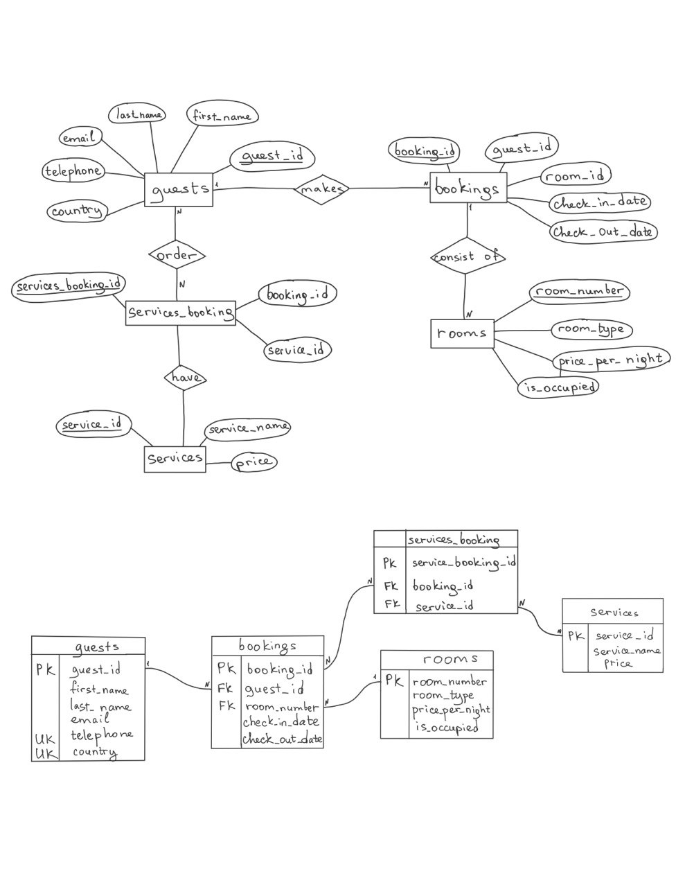

# Final project "Hotel Database"

This project presents a database schema for a hotel, as well as a set of SQL queries related to managing information about guests, bookings, rooms and room services.

## Schema



## CRUD 
### Create
##### Adding a guest

```sql
INSERT INTO guests (first_name, last_name, email, telephone, country)
VALUES ('Sam', 'Clafin', 'sam.claflin@gmail.com', '+1234567890', 'UK');
```


##### Adding a room

```sql
INSERT INTO rooms (room_number, room_type, price_per_night, is_occupied)
VALUES (106, 'Standard', 120.00, FALSE);```
